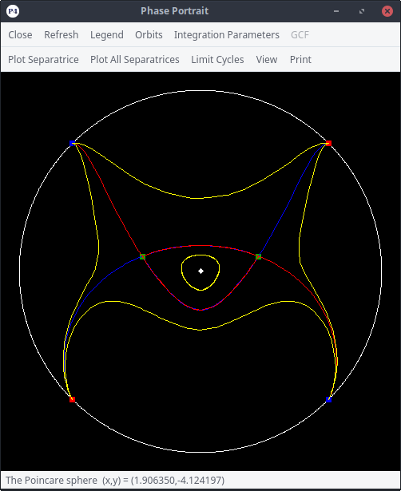

<!--
    This file is part of P4 

    Copyright (C) 1996-2017  J.C. Artés, P. De Maesschalck, F. Dumortier, 
                             C. Herssens, J. Llibre, O. Saleta, J. Torregrosa 

    P4 is free software: you can redistribute it and/or modify 
    it under the terms of the GNU Lesser General Public License as published 
    by the Free Software Foundation, either version 3 of the License, or 
    (at your option) any later version. 

    This program is distributed in the hope that it will be useful, 
    but WITHOUT ANY WARRANTY; without even the implied warranty of 
    MERCHANTABILITY or FITNESS FOR A PARTICULAR PURPOSE.  See the 
    GNU Lesser General Public License for more details. 

    You should have received a copy of the GNU Lesser General Public License 
    along with this program.  If not, see <http://www.gnu.org/licenses/>. 
-->

# P4 (Polynomial Planar Phase Portraits) version 6.0.0

## Description

P4 is a software that is able to draw the planar phase portrait for any polynomial differential system on the Poincaré or Poincaré-Lyapunov compactified planes.

Check the installation instructions for [Linux][linux_install], [Windows][windows_install] and [macOS][macOS_install], and also check out the [FAQ][faq].

|
:-------------------------------------------------:|:---------------------------------------------------:

## Linux

### Installation

Check [release page][latest_release] to see more detailed instructions and download links.

0. Check [dependencies](#dependencies "Dependencies section"), every item must be satisfied
1. Clone the repository: `git clone https://github.com/oscarsaleta/P4.git P4-git && cd P4-git`,
2. Execute the installation script `./compile_install_p4` and follow the instructions,
3. Done!

### Dependencies

**Maple must be installed in the computer in order to use P4.**
- Make sure you can execute Maple by typing `maple` in the command line. This means that the directory where Maple is installed must be in the path.
    + Modify your shell configuration file (_.bashrc_, _.zshrc_, etc): `export PATH="/path/to/Maple/bin:$PATH"`, where `/path/to/Maple/` must be replaced by the path to the Maple installation in your system.
    + Source the configuration file or open a new terminal to apply the changes.

* **Installation with `compile_install_p4` or compilation from source using `qmake`:**
    - Git: must have to work with *git projects*:
        + Debian-based (Debian/Ubuntu/Mint): `sudo apt-get install git`
        + Fedora-based (Fedora/Kokora/Arquetype): `sudo dnf install git`
        + Arch-based (Archlinux/Antergos): `sudo pacman -S git`
        + (See the [git ArchWiki page](https://wiki.archlinux.org/index.php/git "Git ArchWiki page") for more information and configuration instructions).
	- Qt modules *QtCore*, *QtGui*, *QtWidgets*, *QtPrintSupport* (minimum required version 5.2.1, could work for 4.6.0 but this has not been tested):
        + Debian-based (Debian/Ubuntu/Mint): `sudo apt-get install qt5-default`
        + Fedora-based (Fedora/Kokora/Arquetype): `sudo dnf install qt5*-devel --allowerasing`
        + Arch-based (Archlinux/Antergos): `sudo pacman -S qt5-base`
	- `qmake` (version 3.0 recommended):
        + Debian-based (Debian/Ubuntu/Mint): `sudo apt-get install qt5-qmake`
        + Other distros: already installed if you followed the install instructions for Qt 5.
	- C++ compiler: `g++` (version >= 4.9 recommended, must support the **C++11** standard):
        + Debian-based (Debian/Ubuntu/Mint): `sudo apt-get install gcc g++`
        + Fedora-based (Fedora/Kokora/Arquetype): `sudo dnf group install 'Development Tools'`
        + Arch-based (Archlinux/Antergos): `sudo pacman -S gcc`
    - `pkg-config` (0.28 or greater):
        + Debian-based (Debian/Ubuntu/Mint): `sudo apt-get install pkg-config`
        + Fedora-based (Fedora/Kokora/Arquetype): `sudo dnf install pkgconfig`
        + Arch-based (Archlinux/Antergos): `sudo pacman -S pkg-config`
    - `mpfr` library (version >= 3.1.2):
        + Debian-based (Debian/Ubuntu/Mint): `sudo apt-get install libmpfr-dev`
        + Fedora-based (Fedora/Kokora/Arquetype): `sudo dnf install mpfr-devel`
        + Arch-based (Archlinux/Angergos): `sudo pacman -S gmp mpfr`
* **Compilation from source using Qt Creator:**
    - Dependencies itemized above,
	- Qt Creator IDE:
        + Debian-based (Debian/Ubuntu/Mint): `sudo apt-get install qtcreator`
        + Fedora-based (Fedora/Kokora/Arquetype): `sudo dnf install qt-creator`
        + Arch-based (Archlinux/Antergos): `sudo pacman -S qtcreator`

## Windows

### Installation

Check [release page][latest_release] to see more detailed instructions and download links.

1. Download *P4_windows-setup_\*.exe* from [here][latest_release],
2. Execute installer and follow the instructions,
3. Done!

### Dependencies

**Maple must be installed in the computer in order to use P4.**

* **Installation using `P4setup.exe`**:
	- Dependencies are taken care of.
* **Compilation from source using Qt Creator:**
	- Qt modules *QtCore*, *QtGui*, *QtWidgets*, *QtPrintSupport* (minimum required version 5.2.1, could work for 4.6.0 but it has not been tested).
        + Download from [Qt website](https://www.qt.io/ "Qt official website"),
	- C++ compiler: Microsoft Visual C++ Compiler (tested with versions 14.0 and 15.0).
        + Download from [Visual Studio Community](https://www.visualstudio.com/vs/cplusplus/#downloads "Visual Studio Community C++ download").

## macOS

### Installation

Check [release page][latest_release] to see more detailed instructions and download links.

0. Check [dependencies](#dependencies-2 "Dependencies section"), every item must be satisfied. The installation script will try to solve some of the dependencies but it is much easier if you manually install them following the instructions.
1. Clone the repository `git clone https://github.com/oscarsaleta/P4.git P4-git && cd P4-git`,
2. Execute the installation script `./compile_install_p4` and follow the instructions,
3. Done!

### Dependencies

**Maple must be installed in the computer in order to use P4.**
- Make sure you can execute Maple by typing `maple` in Terminal:
    + Edit your shell configuration file (_.bashrc_, _.zshrc_, etc) with the following line: `export PATH="/Library/Frameworks/Maple.framework/Versions/XXX/bin:$PATH"`, where `XXX` should be replaced by your installed Maple version.
    + Restart the Terminal for the changes to be effective.

* **Installation of pre-compiled binaries**:
    - Homebrew: package manager for macOS that will help us install Qt and MPFR (see [Homebrew website](https://brew.sh/index_ca.html "Homebrew official website"))
        + Run in terminal: `/usr/bin/ruby -e "$(curl -fsSL https://raw.githubusercontent.com/Homebrew/install/master/install)"`
    - Qt and qmake: installed using Homebrew
        + Run in terminal `brew install qt`
        + Follow the instructions (_IMPORTANT: modify the PATH as the installer suggests so the system will be able to find the libraries_)
* **Installation with `compile_install_p4`**:
    - Xcode: macOS suite for software development. Install from the App Store, then open it and accept the Terms of Use.
    - *Comand line developer tools*: this adds necessary programs such as `git` and `clang` to the system.
        + To install, run `xcode-select --install` in Terminal
    - Homebrew: package manager for macOS that will help us install Qt and MPFR (see [Homebrew website](https://brew.sh/index.html "Homebrew official website"))
        + Run in terminal: `/usr/bin/ruby -e "$(curl -fsSL https://raw.githubusercontent.com/Homebrew/install/master/install)"`
    - Qt and qmake: installed using Homebrew
        + Run in terminal `brew install qt`
        + Follow the instructions (_IMPORTANT: modify the PATH as the installer suggests so the system will be able to find the libraries_)
    - MPFR library: installed using Homebrew
        + Run in terminal `brew install mpfr`
    - _You will need to open a new terminal if you updated the PATH for the changes to take effect_

## Manually build P4 from source in UNIX systems

### Automatic build and install for Linux using `compile_install_p4`

This is the easiest way in Linux and macOS to get a working P4 application.

* Clone this repository: `git clone https://github.com/oscarsaleta/P4.git`.
* Change directory into the repository folder: `cd P4`.
    - If you want the **newest unstable version** of P4 (which is not as tested as the stable release), checkout the _release candidate_ branch: `git checkout release_candidate`.
* Execute the script and follow the instructions: `./compile_install_p4`. This will check for dependencies, compile, and install P4 in your computer (if requirements are met).

### Build using `qmake`

Qt's `qmake` makes it easy to compile the whole project with two commands.

* From the root of the project, run `qmake -r P4.pro` in order to generate the Makefiles.
* From this same directory, run `make` to compile **p4**, **lyapunov** and **separatrice**.
    - The output of the compilation will be found in a new directory named *build*.
    - The `make` command also compiles **mplstrip**, which is a C++ program used to generate Maple scripts inside *src-mpl*.
* **If your Maple version is NOT 2015**: go into *src-mpl* and execute:
    - `make -f MakeTexMaple clean`
    - `make -f MakeTexMaple all`
    This will generate **p4gcf.m** and **p4.m**, two Maple scripts needed by P4.
* From the root directory of the project, run `make install` to generate a *p4* folder with the layout explained [here][binary_tree]. This directory can be placed anywhere in the system and P4 can be executed using `/path/to/p4/bin/p4`.
* It is advisable that you set the environment variable `P4_DIR=/path/to/p4` to the correct path of the P4 directory in your shell configuration script (_.bashrc_, _.zshrc_, etc.).

### Build using Qt Creator

Check [here](QtCreator/README.md#manually-build-p4-from-source-using-qt-creator "Build P4 from source with Qt Creator") for instructions on how to build this project using Qt Creator.

## Binary tree

Check [here][binary_tree] for instructions of how to create a correct file tree for P4 to work after each of its parts has been compiled.

## Files

* **binaries**: some development scripts that help creating binaries for Linux and Windows (this directory doesn't actually contain any binaries, you can find those [here][latest_release]).
* **help**: Help files in *.html* format and supporting images.
* **mpir**: *(relevant to Windows only)* copy of [MPIR repository](https://github.com/wbhart/mpir "MPIR GitHub repository"), a fork of GMP (GNU Multiprecision library), for multiprecision integer computations.
* **mpfr**: *(relevant to Windows only)* copy of [MPFR repository](https://github.com/BrianGladman/mpfr "MPFR GitHub repository"), the GNU MPFR library, for multiprecision floating point computations.
* **QtCreator**: files and projects for building P4 using Qt Creator.
* **src-gui**:
    * **lyapunov**: C++ code for numerical computation of Lyapunov constants
    * **lyapunov_mpf**: C++ code for numerical computation of Lyapunov constants (multiprecision version)
    * **p4**: C++/Qt source code for the GUI of P4,
    * **separatrice**: C++ code for numerical computation of separatrices
* **src-mpl**: Maple scripts that drive the computations of P4 (finding singular points, algebraic computation of Lyapunov constants, blow-ups, etc.).

## FAQ

- I installed P4 using precompiled binaries, but the program doesn't work.
    + Precompiled binaries often work only in systems equivalent to those in which the compilation was performed (due to missing libraries or mismatching software versions). This is why in Linux and macOS it is recommended to use the _compile\_install\_p4_, which compiles P4 to adapt to the system characteristics.
- I installed P4 and it executes, but when I press _Evaluate_ the output window shows "_External Command: /some/maple/command untitled.txt_" and does nothing.
    + This means that `/some/maple/command` is not a recognised command in your system.
        * Linux and macOS: Check that you have Maple installed and that `maple` is a valid command in the terminal (see [Linux][linux_install] or [macOS][macos_install] instructions).
        * Linux, Windows and macOS: go to _About P4... > Main Settings_ and check that the _Maple Executable_ field points to the right Maple installation directory or has the correct `maple` command.
- I installed P4 and it executes, but when I press _Evaluate_ the output says "_Error, could not open \`/path/to/p4/bin/p4.m\` for reading_".
    + Check that `/path/to/p4` in the Maple output is the correct path for your P4 installation.
        * If the path is correct: check that the files _p4.m_ and _p4gcf.m_ exist in the P4 installation directory. If they don't, then you need to reinstall P4 because something went wrong and the installation did not complete properly.
        * If the path is wrong: check that you defined correctly the `P4_DIR` environment variable in _.bashrc_ (or _.zhsrc_, or any other shell configuration file you use). Also, within P4, go to _About P4... > Main Settings_ and check that the _Base installation Path_ and the _Sumtable Path_ fields point correctly to your P4 installation directory.

## Contributors

- J.C. Artés (Universitat Autònoma de Barcelona)
- P. De Maesschalck (Hasselt University)
- F. Dumortier (Hasselt University)
- C. Herssens (Hasselt University)
- J. Llibre (Universitat Autònoma de Barcelona)
- O. Saleta (Universitat Autònoma de Barcelona)
- J. Torregrosa (Universitat Autònoma de Barcelona)

[latest_release]: https://github.com/oscarsaleta/P4/releases/latest "Latest P4 release"
[binary_tree]: QtCreator/README.md#binary-tree "Binary tree section"
[linux_install]: #linux
[windows_install]: #windows
[macos_install]: #macos
[faq]: #faq